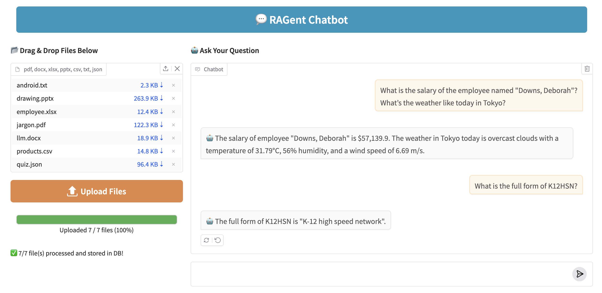

# 🤖 RAGent Chatbot — Intelligent RAG + ReAct Assistant

> 💡 **Blog Guide**: [How This Chatbot is Built](https://shafiqulai.github.io/blogs/blog_6.html)

The **RAGent Chatbot** is a smart, modular, and explainable AI assistant that combines **Retrieval-Augmented Generation (RAG)** with **ReAct-style agent reasoning**. It goes beyond document Q&A — deciding when to read, when to think, and when to act using tools like web search, Wikipedia, calculator, and more.

  

## 🧠 What Can RAGent Do?

<ul style="padding-left: 40px;">
  <li>📄 Answer questions from uploaded documents (PDF, DOCX, PPTX, XLSX, TXT, CSV, JSON)</li>
  <li>🛠️ Use external tools dynamically — web search, weather, Wikipedia, calculator, etc.</li>
  <li>🔍 Combine semantic and keyword search using <b>hybrid retrieval</b></li>
  <li>🧠 Think step-by-step using the <b>ReAct agent framework</b></li>
  <li>💬 Maintain chat context using memory for natural multi-turn conversations</li>
</ul>

## 🧱 Architecture Highlights

<ul style="padding-left: 40px;">
  <li>🤖 <b>ReAct Agent</b>: Reasoning + tool calling in a loop: Thought → Action → Observation → Final Answer</li>
  <li>📚 <b>RAG Pipeline</b>: Retrieves relevant chunks from Qdrant DB and answers with Gemini LLM</li>
  <li>🛠️ <b>Custom Tooling</b>: Extensible tool framework (BaseTool) with weather, web, wiki, calculator, LLM, etc.</li>
  <li>💾 <b>Memory</b>: Per-session chat history powered by MemoryManager</li>
  <li>🖥️ <b>Gradio UI</b>: Intuitive chat + upload interface</li>
</ul>

## 🛠 Tech Stack

| Layer        | Technology                          |
|--------------|--------------------------------------|
| 🧠 LLM        | Google Gemini via LangChain          |
| 📦 Embeddings | BAAI/bge-base-en-v1.5               |
| 🔍 Vector DB  | Qdrant (supports hybrid search)     |
| 💬 UI         | Gradio                              |
| 🧰 Tools      | Tavily API, OpenWeather, Wikipedia, Calculator |

## 📸 Live Preview

Try the RAGent Chatbot in your browser and upload your own documents:

- 🤗 **Hugging Face App**: [Try it Live](https://huggingface.co/spaces/shafiqul1357/ragent-chatbot)

## 🧪 Sample Prompts

<ul style="padding-left: 40px;">
  <li>🗃️ "What is the IT budget for 2023?" → Answer from your document using <b>rag_search</b></li>
  <li>🌦️ "What’s the weather in Tokyo today?" → Uses <b>weather</b> tool via OpenWeather API</li>
  <li>📚 "What is quantum computing?" → Searches <b>Wikipedia</b></li>
  <li>➗ "What’s 245 * 92?" → Invokes <b>calculator</b></li>
  <li>✍️ "Summarize the benefits of LangChain" → Falls back to <b>llm_instruction</b> tool</li>
</ul>

## 🚀 How It Works (Quick Summary)

1. 📂 **Upload documents** → Processed & chunked with overlapping windows
2. 📦 **Store chunks** → Embedded using BAAI and stored in Qdrant with tokenized keywords
3. 💬 **Ask a question** → ReAct agent decides whether to use:
   - rag_search for document-based answers
   - tools like web_search, wikipedia, calculator, weather
   - or fallback to Gemini via llm_instruction
4. 🔄 **Responds intelligently** → Step-by-step reasoning with full transparency
5. 🧠 **Context retained** → Chat memory keeps track of all past Q&A

## ✨ Want to Learn More?

📘 Dive deeper into the design, code, and reasoning logic in our full blog post:

👉 [📝 Read the Full Guide](https://shafiqulai.github.io/blogs/blog_6.html)

This guide walks you through the architecture, ReAct prompts, tool integration, and Qdrant-based hybrid search — everything from concept to deployment.
